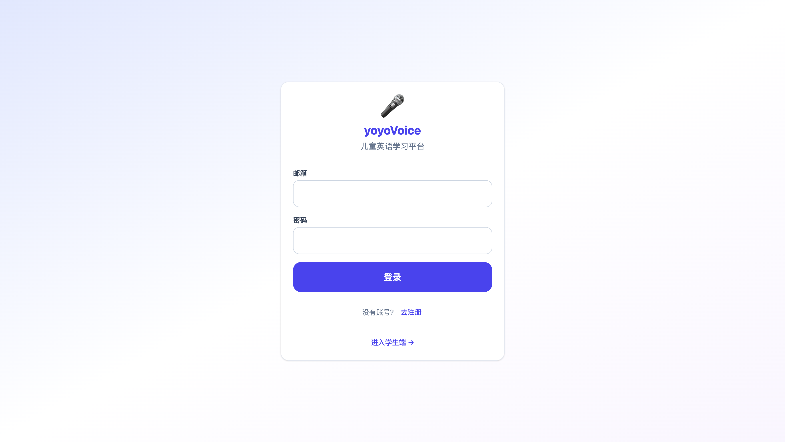
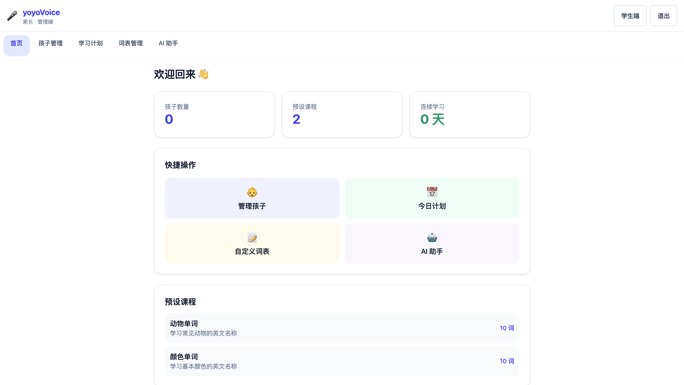
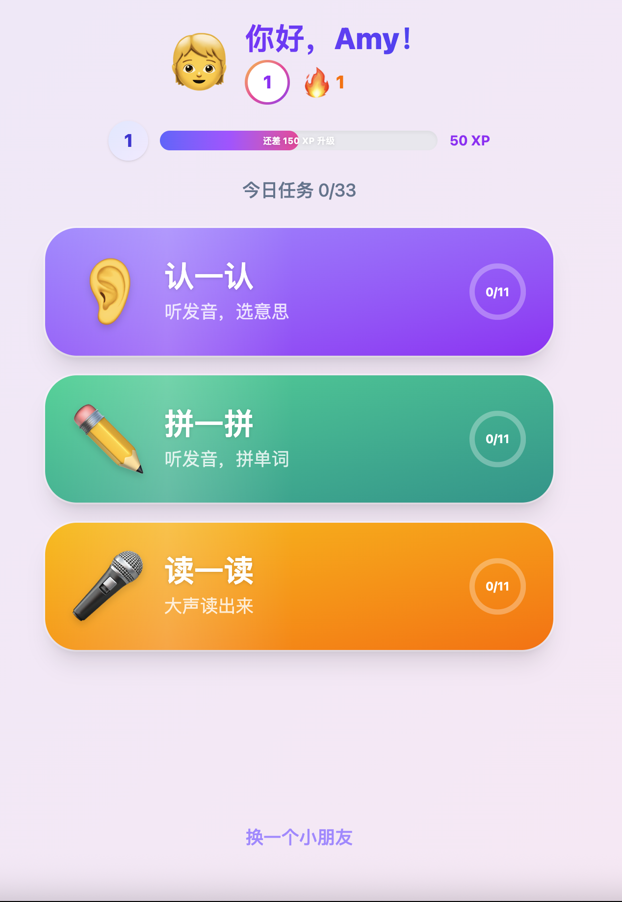
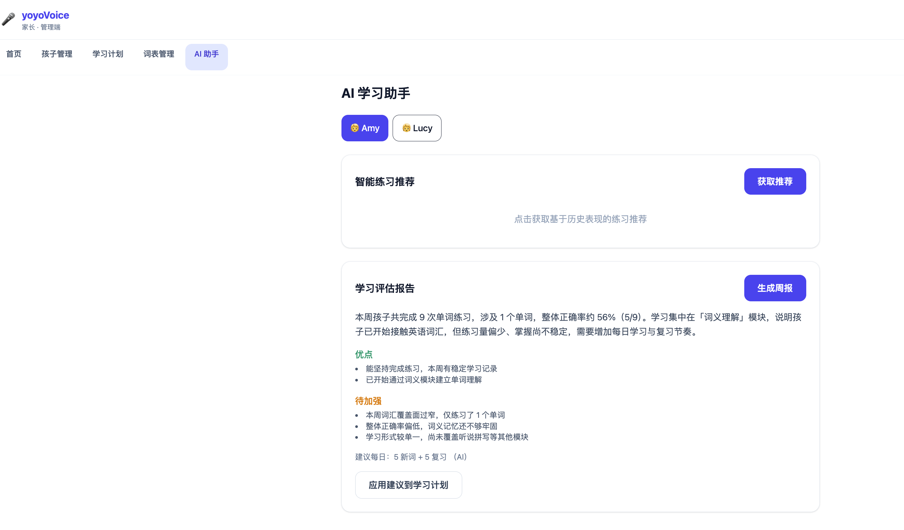
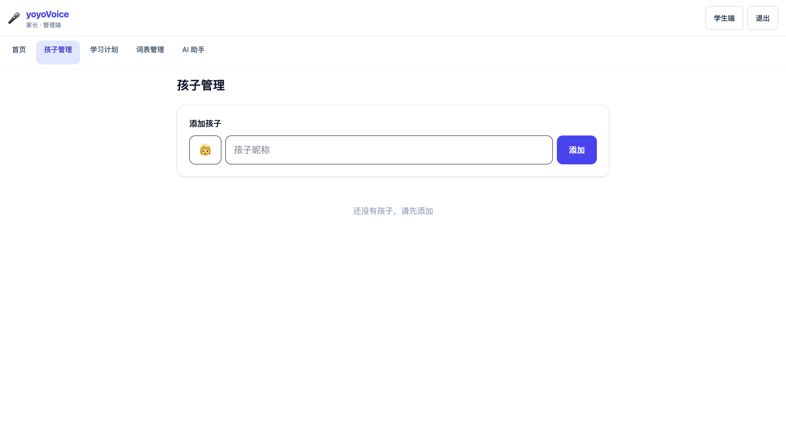
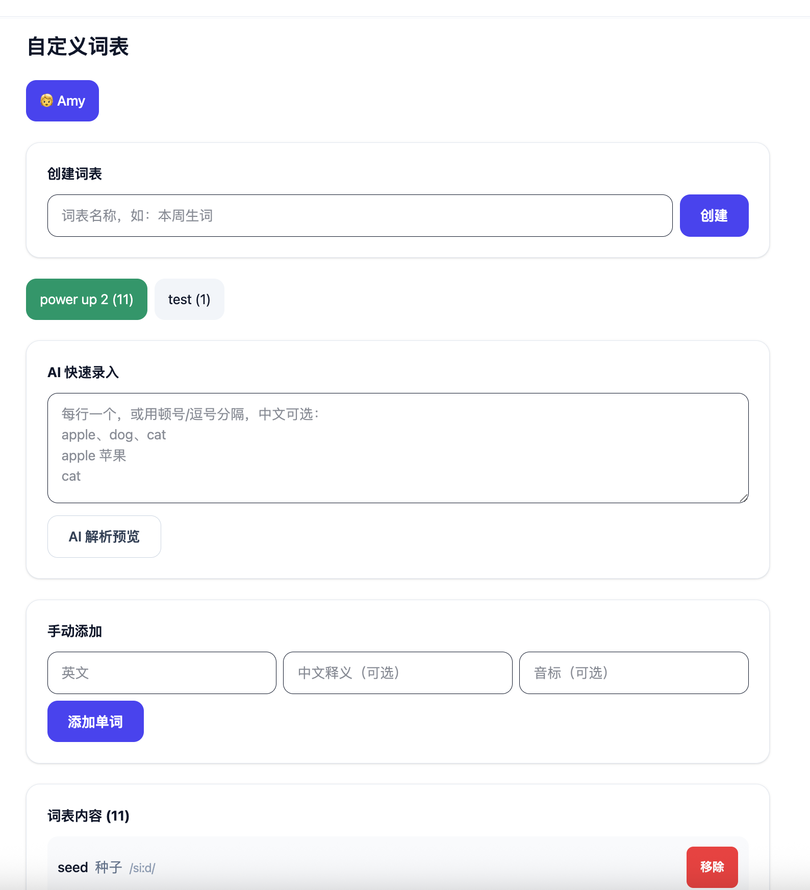

# yoyoVoice

> 面向儿童英语启蒙的练习平台，支持释义、拼写、发音三类训练，提供家长管理端与学生学习端。


## 项目截图

### 登录页


### 家长端首页（Dashboard）


### 学生端首页


### AI 学习助手（基于历史学习分析）


### 孩子管理页


### 词表管理页（空状态）


## 核心功能

- **双端设计**：家长管理端 + 学生学习端，职责分离
- **三大学习模块**：释义选择、拼写输入、发音评估
- **学习源切换**：预设课程 + 自定义词表
- **多孩子支持**：每个孩子独立学习进度与计划
- **每日学习计划**：自动组合新词学习与复习
- **AI 辅助能力**：基于历史学习记录（正确率、用时、模块表现）生成可解释推荐，并支持周报分析

## 技术栈

- **Frontend**: React 19, TypeScript, Vite, Tailwind
- **Backend**: FastAPI, SQLAlchemy, Pydantic, Uvicorn
- **Database**: SQLite（可切换）
- **Speech**: Azure Pronunciation Assessment（可选）
- **AI**: Cursor SDK / OpenAI 兼容能力（可选）

## 快速开始

环境要求：Python 3.12+、Node.js 20.19+ 或 22.12+（推荐 22）。

### 方式 1：一键启动（推荐开发）

```bash
chmod +x scripts/dev.sh
./scripts/dev.sh
```

启动后：
- 前端：`http://127.0.0.1:5173`
- 后端：`http://127.0.0.1:8000`

### 方式 2：手动启动

#### 1) 后端

```bash
cd backend
python3 -m venv .venv
source .venv/bin/activate
pip install -r requirements.txt
cp .env.example .env
uvicorn app.main:app --host 0.0.0.0 --port 8000 --reload
```

#### 2) 前端

```bash
cd frontend
npm install
npm run dev -- --host 0.0.0.0 --port 5173
```

## 环境变量

后端配置位于 `backend/.env`（可由 `backend/.env.example` 复制得到）。

| 变量 | 说明 |
|------|------|
| `SECRET_KEY` | JWT 签名密钥 |
| `DATABASE_URL` | 数据库连接，默认 SQLite |
| `AZURE_SPEECH_KEY` | Azure 语音服务密钥（可选） |
| `AZURE_SPEECH_REGION` | Azure 区域（可选） |
| `CURSOR_API_KEY` | AI 服务密钥（可选） |
| `CURSOR_MODEL` | 使用的 AI 模型（可选） |

> 不配置 Azure / AI 相关密钥时，项目仍可运行基础学习流程。

## Docker 运行

项目包含根目录 `Dockerfile`，可直接构建并运行：

```bash
docker build -t yoyovoice .
docker run --rm -p 8000:8000 yoyovoice
```

访问：`http://127.0.0.1:8000`

## 开发与测试

- 前端代码目录：`frontend/src`
- 后端代码目录：`backend/app`
- 后端测试目录：`backend/tests`

常用命令：

```bash
# 后端测试
cd backend && .venv/bin/pytest

# 前端构建检查
cd frontend && npm run build
```

## 项目结构

```text
backend/          FastAPI 服务与业务逻辑
frontend/         React 前端应用
data/             本地数据库与音频缓存
docs/screenshots/ README 展示截图
scripts/          开发辅助脚本
```

## 开源路线建议

- [ ] 增加英文版 README（`README.en.md`）
- [ ] 提供 demo 数据初始化脚本
- [ ] 增加 CI（lint + test）
- [ ] 增加 E2E 截图回归

## 贡献

欢迎 issue 和 PR，建议先阅读 `CONTRIBUTING.md`。

## 许可证

本项目使用 [MIT License](LICENSE)。
